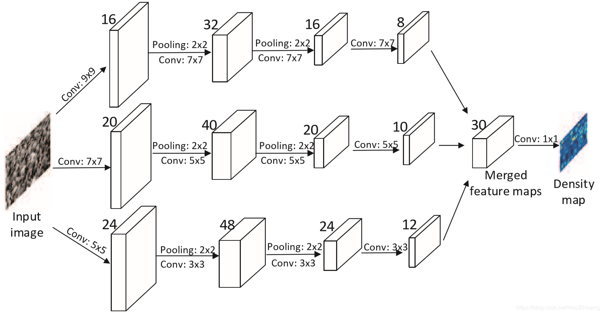

### Paddle_CV
该代码仓库致力于使用`paddlepaddle`实现一些CV的常用算法


### 环境
```
python3.6
paddlepaddle1.7
```


### MCNN实现

论文位置：`./paper/Zhang_Single-Image_Crowd_Counting_CVPR_2016_paper.pdf`

代码位置：`./Crowd Counting/MCNN`





